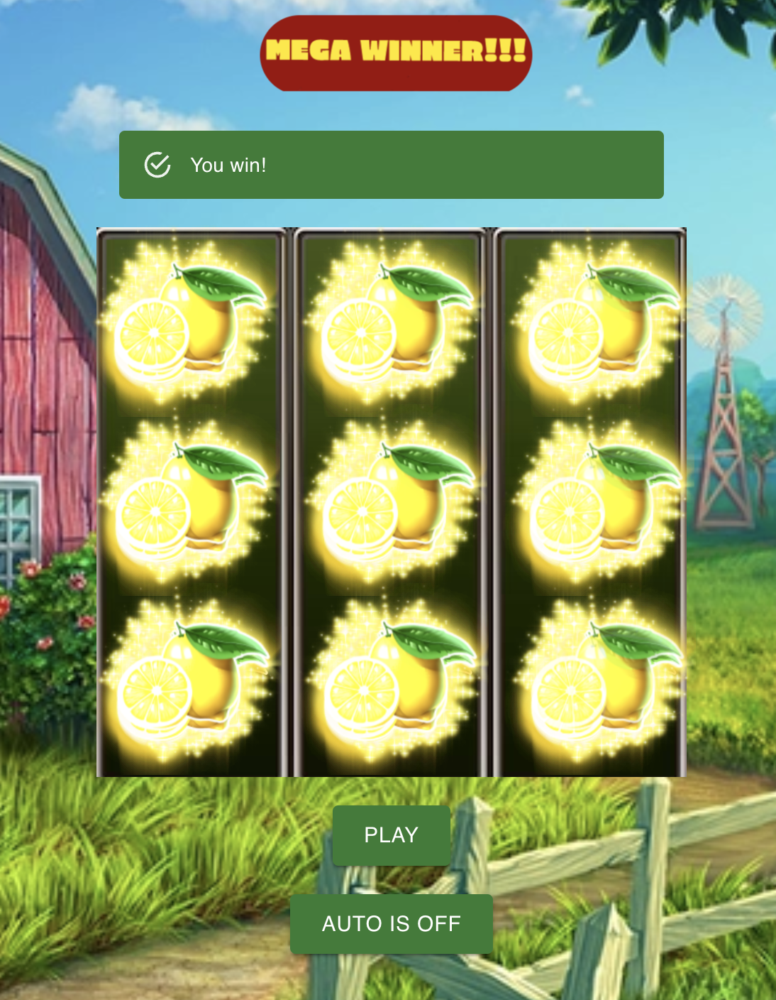

# SlotMachine Game 3x3
### Simple game made with React, TailwindCss and GSAP
</img>

Game content:
- 3 reels with 3 elements inside in each reel.
- They are random elements generating
- We have button for Spin the reels, this button become Stop while the reels are spinning.
- We have AutoPlay button also.
- Basically it's checking each row for win. If 3 elements from same time encounter we got a winner message and the elements are begin animated.
- With 1 winning row we get "WINNER", with 2 winning rows we get "BIG WINNER!" and with 3 we got the "MEGA WINNER!!!"
- We also have some usefull alerts.

# Technologies

1. React - mostly because of the hooks.
2. TailwindCss - all the styling is made with tailwind.
3. GreenSock - GSAP is used for all the animation we have in the game.
4. MuiCore - for some buttons and alerts.

# You can test the game DEMO here:
https://enermax5555.github.io/SlotMachine_Demo/

# How to set up

1 Clone the repo
>git clone https://github.com/enermax5555/SlotMachine_Demo

2 You will need to install all the dependancies(you will need node.js)
- React
- Tailwind
- GSAP
  
I will provide in helpful links the installation instructions.

3 You can start your own local server via node.
>npm start

## Helpful links

[Node](nodejs.org)

[React](https://legacy.reactjs.org/docs/getting-started.html)

[TailwindCSS](https://tailwindcss.com/docs/installation)

[GSAP](https://greensock.com/docs/v3/Installation)